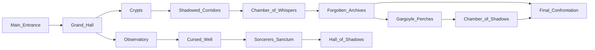

# Zork-Like

## Introduction

Zork is a text-based adventure game that was one of the earliest and most influential examples of interactive fiction.

The term "Zork" does not have a specific meaning in the English language. The name "Zork" was chosen by the game's creators as a whimsical and catchy title for their adventure game. It has since become synonymous with the genre of text-based adventure games and holds a significant place in the history of video games. It was created by Tim Anderson, Marc Blank, Bruce Daniels, and Dave Lebling who were a group of programmers at the Massachusetts Institute of Technology (MIT). Zork was written in the MDL programming language and originally ran on a DEC PDP-10 mainframe computer.

In Zork, players navigate through a series of locations within a vast underground dungeon, solving puzzles and interacting with the environment through text commands. The game's text-based interface presents players with descriptions of their surroundings and prompts them to enter commands to perform actions like picking up objects, examining the environment, or interacting with non-player characters.

The game's objective is to explore the world, solve puzzles, and collect treasures. The Zork series expanded over time, with subsequent versions offering more complex storylines, larger game worlds, and enhanced features. Zork gained widespread popularity and was eventually ported to various computer platforms, including personal computers and gaming consoles.

Zork's success paved the way for the interactive fiction genre, inspiring numerous other text adventure games and influencing the development of graphical adventure games as well. It remains an iconic example of early computer gaming and has left a lasting impact on the gaming industry.

## Background

Zork is a classic text-based adventure game that was developed in the late 1970s by a group of programmers at the Massachusetts Institute of Technology (MIT). Zork quickly gained popularity and became one of the most influential games in the adventure genre, laying the foundation for the development of interactive fiction and text-based adventure games. Here's a brief history of Zork and its impact on the gaming industry:

**Origins:**

In 1977, a group of MIT students and programmers known as the Dynamic Modeling Group started developing a game called "Zork" on a DEC PDP-10 mainframe computer. Zork was initially inspired by the Adventure game developed by Will Crowther and Don Woods in the early 1970s. As development progressed, Zork evolved into a more complex and expansive game, featuring rich descriptions, puzzles, and a vast game world.

**Commercial Success:**

In 1979, Zork was released commercially by Infocom, a software company founded by former members of the Dynamic Modeling Group. Infocom marketed Zork as an interactive fiction game, targeting computer enthusiasts and adventure game fans.
Zork became a huge success, selling over one million copies across various platforms, including personal computers and game consoles.

**Influence on Adventure Games:**

Zork popularized the text-based adventure game genre and introduced players to the concept of exploring a virtual world through text commands. The game featured detailed descriptions, immersive storytelling, and intricate puzzles, setting a standard for future adventure games. Zork's success inspired the development of numerous text-based adventure games, both by Infocom and other companies, throughout the 1980s.

**Evolution into Graphical Adventures:**

As technology advanced, text-based adventure games transitioned into graphical adventures with the introduction of graphical user interfaces. Zork's influence can be seen in early graphical adventure games, such as Sierra On-Line's King's Quest series and LucasArts' Monkey Island series. The concepts of exploration, puzzle-solving, and narrative-driven gameplay that Zork popularized continued to shape and inform the design of adventure games in the graphical era.

**Legacy and Remakes:**

Zork remains a beloved and iconic game, often referenced in popular culture and revered by fans of classic adventure games.

Over the years, Zork has been remade and reimagined in various forms, including graphical remakes, online adaptations, and fan-created projects. The spirit and gameplay mechanics of Zork have influenced modern adventure games, inspiring developers to create immersive narratives and challenging puzzles.

Zork's rich history and groundbreaking gameplay have made it a significant landmark in the gaming industry. Its influence on adventure games, from its text-based roots to the transition into graphical adventures, has shaped the genre and inspired countless developers to create memorable gaming experiences.

There have been several variants and adaptations of the original Zork game over the years.

Here is a list of notable Zork variants:

* Zork I, II, and III (1980-1982): The original trilogy of Zork games developed by Infocom. They form a cohesive storyline and are the most well-known versions of Zork.

* Zork Zero (1988): A prequel to the original trilogy, providing background information on the Great Underground Empire. It features improved graphics and gameplay mechanics.

* Return to Zork (1993): A graphical adventure game released by Activision. It introduced a point-and-click interface and full-motion video, departing from the text-based gameplay of the original Zork.

* Zork Nemesis (1996): A dark and atmospheric graphical adventure game set in the Zork universe. It incorporated a more mature and complex narrative with challenging puzzles.

* Zork: The Undiscovered Underground (1997): An officially released expansion pack for Zork Nemesis. It introduced new areas, puzzles, and characters to the Zork universe.

* Zork: Grand Inquisitor (1997): Another graphical adventure game set in the Zork universe. It combined humor, puzzles, and exploration with full-motion video cutscenes.

* Legends of Zork (2009): A browser-based, multiplayer online game that reimagined Zork as a persistent online world. It featured quests, battles, and community interactions.

* Zork: A Troll's Eye View (1996): A spin-off game that offers a different perspective, allowing players to control a troll in the Zork universe. It provided a humorous and unconventional gameplay experience.

* Zork Chronicles (1997): A graphical adventure game set after the events of the original trilogy. It continued the story of Zork with new characters, locations, and puzzles.

The Zork franchise has seen numerous other releases, including fan-made games and interactive fiction titles inspired by the original Zork. Each variant brings its own unique take on the Zork universe while staying true to the spirit of exploration, puzzle-solving, and storytelling that made the original game so popular.

## MIT Design Language (MDL)

MDL stands for "MIT Design Language" which was a programming language developed at the Massachusetts Institute of Technology (MIT) in the 1970s. MDL was specifically designed for implementing and running interactive fiction games, with Zork being one of the most notable examples.

MDL was an extension of the LISP programming language, which was known for its flexibility and expressive power. It allowed the Zork developers to create complex text-based worlds and implement sophisticated game mechanics. MDL provided features for handling textual input and output, manipulating data structures, and managing game state.

Although MDL was primarily used for Zork and other interactive fiction games at MIT, it also influenced the development of other programming languages and systems. Its design principles and concepts have been carried forward into subsequent interactive fiction languages and tools, such as Inform and TADS (Text Adventure Development System).

Here's a simple example of MDL code:

```mdl

<DEFINE ROOM-FUNCTION (ROOM)
    <SET .WHERE <GET .ROOM ,WHERE>>>
    
<DEFINE (LOOK)
    <COND (<EQUAL? <TYPE ,WHAT>> <TELL "You are in " .WHERE>)
          (ELSE <TELL "You see nothing unusual here.">)>>
          
<DEFINE (TAKE)
    <COND (<NOT <TYPE ,WHAT>> <TELL "You can't take that.">)
          (<AND <NOT <GET ,WHAT ,AT?>> <NOT <GET ,WHAT ,IN?>>> <TELL "You don't see that here.">)
          (<AND <GET ,WHAT ,AT?> <EQUAL? ,WHAT <OBJECT CARRIED>>> <TELL "You're already carrying that.">)
          (<AND <GET ,WHAT ,AT?> <AND <GET ,WHAT ,IN?> <EQUAL? <OBJECT CARRIED <GET ,WHAT ,IN?>> <GET ,WHAT ,AT?>>> <TELL "You're already carrying that.">)
          (<AND <GET ,WHAT ,AT?> <SET ,WHAT <OBJECT CARRIED <GET ,WHAT ,AT?>>> <TELL "Taken.">)
          (<AND <GET ,WHAT ,IN?> <SET ,WHAT <OBJECT CARRIED <GET ,WHAT ,IN?>>> <TELL "Taken.">)
          (ELSE <TELL "You don't see that here.">)>>
          
<DEFINE (DROP)
    <COND (<EQUAL? ,WHAT <OBJECT CARRIED>>) <SET ,WHAT <GET ,WHAT ,IN?>> <TELL "Dropped.">)
          (ELSE <TELL "You're not carrying that.">)>>

```

In this example, you can see three functions defined using MDL syntax: ROOM-FUNCTION, LOOK, TAKE, and DROP. These functions are part of a larger MDL program for implementing game mechanics in an interactive fiction game.

The ROOM-FUNCTION function is used to define a room and store its location. The LOOK function is used to describe the player's current location or provide a default message if nothing unusual is seen. The TAKE function is used to handle taking objects in the game, checking if the object is present and whether it can be carried. The DROP function is used to handle dropping objects, checking if the object is currently carried by the player.

Please note that this is a simplified example, and in a complete MDL program, you would have more extensive code for defining the game world, implementing interactions, and managing the game state.

## Software Architecture

Zork is categorized as an **interactive fiction** or **text adventure game**. These types of games rely heavily on text-based descriptions and commands to navigate and interact with the game world. Players progress through the game by typing in commands to perform actions, solve puzzles, and advance the storyline. While interactive fiction games like Zork lack graphical or visual elements, they compensate by providing rich narrative experiences and allowing players to engage their imagination to visualize the game world based on the textual descriptions.

Here's a high-level software architecture for a _Zork-like_ game:

User Interface Layer: This layer handles user input and output, providing a way for the player to interact with the game. It may include components like a command line interface or a graphical user interface (GUI) to display the game's text-based interface and capture player commands.

Game Logic Layer: This layer contains the core game logic and mechanics. It includes components responsible for managing the game state, maintaining the world model, and executing actions based on player commands. This layer interprets the user input, updates the game state accordingly, and generates appropriate responses to be displayed to the player.

World Model: The world model represents the game world, including its locations, objects, characters, and their relationships. It may use data structures such as graphs, maps, or object-oriented models to organize and represent the game world's entities and their properties.

Parser: The parser component is responsible for understanding and parsing player input. It interprets the player's commands and extracts relevant information, such as the action to be performed and any associated parameters or arguments. The parser converts user input into a format that can be easily processed by the game logic layer.

Game Database: The game database holds structured data related to the game, such as information about objects, characters, locations, and their properties. It provides a persistent storage mechanism for saving and loading game states, allowing players to continue their progress across multiple sessions.

Content Creation Tools: These tools assist game designers and developers in creating and managing game content. They may include text editors, scripting languages, or graphical tools for designing and editing game maps, puzzles, dialogues, and other game elements.

External Services: This optional layer represents external services that the game may interact with, such as online leaderboards, multiplayer functionality, or social sharing features. It allows players to connect with other players or access additional features beyond the core game experience.

Note that the provided architecture is a generalized representation and can be adapted based on specific implementation choices and requirements. The architecture can be expanded or modified to incorporate additional features, such as combat mechanics, puzzle-solving, or more complex interactions with the game world.

Here's an example code structure that reflects the software architecture for a Zork-like game:

```bash

game/
├── ui/
│   ├── command_line.py        # Command line interface implementation
│   └── graphical_interface.py # Graphical user interface implementation
├── logic/
│   ├── game_engine.py          # Game engine and core logic
│   ├── world_model.py          # World model representation
│   ├── parser.py               # Input parser component
│   └── game_database.py        # Game database implementation
├── content/
│   ├── levels/                 # Game levels and maps
│   ├── objects/                # Object definitions and properties
│   ├── characters/             # Character definitions and properties
│   ├── puzzles/                # Puzzle designs and solutions
│   └── dialogues/              # Dialogue scripts and conversations
├── services/
│   ├── leaderboard_service.py  # External service integration (optional)
│   ├── multiplayer_service.py  # Multiplayer functionality (optional)
│   └── social_service.py       # Social sharing features (optional)
└── main.py                     # Main game entry point
```

In this code structure:

The ui/ directory contains the user interface components. It includes the implementations for the command line interface (command_line.py) and graphical user interface (graphical_interface.py).

The logic/ directory contains the core game logic. It includes the game engine and core logic in game_engine.py, the world model representation in world_model.py, the input parser component in parser.py, and the game database implementation in game_database.py.

The content/ directory holds the game content such as levels, objects, characters, puzzles, and dialogues. Each of these categories has its own subdirectory.

The services/ directory represents optional external services that the game can integrate with. It includes implementations for leaderboard service (leaderboard_service.py), multiplayer functionality (multiplayer_service.py), and social sharing features (social_service.py).

Finally, main.py serves as the entry point for the game.

Please note that this code structure is a simplified example, and you may need to adapt and expand it based on the specific requirements and complexity of your game.

### Content and Formats

To write content for the game, you'll need to create engaging and descriptive text that sets the scene, describes locations, provides item descriptions, and guides players through the game world. Here are some steps to help you write compelling content:

* Define the game world: Start by defining the overall theme, setting, and atmosphere of your game. Determine the style of writing you want to use, whether it's humorous, mysterious, or serious.

* Create locations: Design various locations within the game world, such as rooms, outdoor areas, or special landmarks. For each location, write a description that paints a vivid picture in the player's mind. Include details about the environment, objects, sounds, smells, and any characters or creatures present.

* Develop characters: If your game includes non-player characters (NPCs), create their personalities, appearances, and dialogues. Write engaging dialogues that reveal their traits, motivations, and provide clues or assistance to the player.

* Describe items: Design items that players can interact with, such as weapons, tools, keys, or puzzle pieces. Write descriptions for each item, including their appearance, purpose, and any special abilities or effects they possess.

* Provide instructions and hints: Write instructions and hints to guide players through puzzles, challenges, or quests. Make sure the information is clear and concise, helping players progress without giving away solutions outright.

* Write dialogues and interactions: If your game allows player-character interactions or conversations with NPCs, write engaging dialogues that offer choices and consequences. Consider branching dialogues that lead to different outcomes or reveal additional information.

* Polish the text: Review and edit your content for grammar, spelling, and clarity. Ensure that the text is concise yet descriptive, engaging the players and immersing them in the game world.

* Playtest and iterate: Test your game with real players to gather feedback on the content. Iterate and refine your writing based on player responses, making adjustments to improve clarity, pacing, and player experience.

Remember that writing content for the game is an iterative process. Continuously evaluate the impact of your writing on the player experience and make adjustments as needed. By creating immersive and captivating text, you can enhance the gameplay and storytelling aspects of your game.

Here are some examples of levels, objects, characters, puzzles, and dialogs for the game:

**Levels:**

* The Abandoned Mansion: Explore a spooky mansion filled with secret passages, creaking floors, and eerie atmosphere.
* The Enchanted Forest: Navigate through a dense forest with magical creatures, hidden treasures, and enchanting scenery.
* The Underground Caverns: Descend into dark and treacherous caves, facing dangers like stalactites, underground rivers, and mysterious creatures.

**Objects:**

* Rusty Key: A key covered in rust, found in the dusty attic of the mansion. It unlocks a hidden door to a secret room.
* Potion of Invisibility: A shimmering potion that grants temporary invisibility when consumed. It helps the player evade enemies or bypass traps.
* Grappling Hook: A sturdy hook attached to a rope, allowing the player to reach inaccessible areas or create makeshift bridges.

**Characters:**

* Madam Evangeline: An eccentric fortune teller residing in a tent near the forest. She provides cryptic clues and prophecies about the player's destiny.
* Captain Blackbeard: A legendary pirate ghost haunting the caves. He guards a buried treasure and challenges the player to a high-stakes riddle game.
* Professor Amelia Wright: An archaeologist studying the history of the mansion. She seeks the player's help in unraveling the mansion's secrets and solving ancient puzzles.

**Puzzles:**

* Cryptic Symbols: Encountering a series of cryptic symbols in a hidden chamber, the player must decipher their meaning to unlock a hidden passage.
* Weighted Pressure Plates: To access a hidden room, the player must strategically place objects on a set of pressure plates to match a specific weight combination.
* Pattern Lock: Confronted with a mysterious lock mechanism, the player must observe and replicate a pattern displayed in a nearby painting to open a hidden compartment.

**Dialogs:**

Player to Madam Evangeline:
Player: "I seek guidance, Madam. What lies beyond the dark forest?"
Madam Evangeline: "Beware the ancient guardian, child. Only with the talisman of light can you uncover the path to your destiny."

Player to Captain Blackbeard:
Player: "I've come for the treasure, Captain. What challenge awaits me?"
Captain Blackbeard: "Riddle me this, landlubber. What has keys but can't open locks, space but no room, and you always carry it with you?"

Player to Professor Amelia Wright:
Player: "Professor, how can I uncover the mansion's hidden secrets?"
Professor Wright: "Ah, young explorer, the answer lies within the ancient manuscripts. Translate the forgotten language, and the truth shall be revealed."

These examples showcase the variety of elements you can incorporate into your game, including diverse levels, intriguing objects, memorable characters, challenging puzzles, and immersive dialogs.

Feel free to adapt and expand upon these examples to suit your game's specific storyline and gameplay mechanics.

Here are examples of formats for levels, objects, characters, puzzles, and dialogs in the game:

**Level Format:**

```plaintext

Level Name: [Name of the Level]
Description: [Description of the Level]

- Room 1 -
Description: [Description of the room]
Exits: [Available exits from the room]
Objects: [List of objects in the room]

- Room 2 -
Description: [Description of the room]
Exits: [Available exits from the room]
Objects: [List of objects in the room]

```

**Object Format:**

```plaintext

Object Name: [Name of the Object]
Description: [Description of the Object]
Location: [Initial location of the Object]
Interactions: [List of possible interactions with the Object]

```

**Character Format:**

```plaintext

Character Name: [Name of the Character]
Description: [Description of the Character]
Dialogue: [Dialogue lines for the Character]
Interactions: [List of possible interactions with the Character]

```

**Puzzle Format:**

```plaintext

Puzzle Name: [Name of the Puzzle]
Description: [Description of the Puzzle]
Objective: [Objective of the Puzzle]
Instructions: [Instructions for solving the Puzzle]
Solution: [Solution to the Puzzle]

```

**Dialog Format:**

```plaintext

Character Name:
- [Player line]
- [Character response]
- [Player line]
- [Character response]

```

These formats serve as templates to structure and organize the content in your Zork-like game. You can customize and expand upon them based on the specific requirements of your game and the level of detail you want to provide. Use these formats as a guide to create consistent and coherent content for your game, ensuring that information is clear and easily understood by players.

### Mechanics

Internal game mechanics in a Zork-like game typically involve parsing player input, managing the game state, executing actions, and updating the world model. Here's an explanation of the key components and the parsing process:

**Command Parsing:**

The game receives player input, typically in the form of text commands.
The input is parsed to identify the action the player intends to perform and any additional parameters or objects involved.
The parsed command is then passed to the game engine for further processing.

**Game Engine:**

The game engine processes the parsed command and determines the appropriate action to take based on the current game state.
It manages the overall flow of the game, including interactions with the world model, objects, characters, and puzzles.
The game engine executes actions and updates the game state accordingly.

**World Model:**

The world model represents the game world and its various components, including rooms, objects, characters, and their relationships.
It stores information about the current state of the game world, such as the player's location, inventory, and the status of objects and characters.
The world model is responsible for maintaining consistency and updating the state based on player actions and interactions.

**Content Parsing:**

The game's content, such as descriptions, dialogues, puzzles, and objects, is typically stored in a structured format, such as JSON or XML.
The game engine parses the content data to load and populate the world model with the necessary information.
This parsing process involves reading the data, extracting relevant information, and creating the appropriate game objects and entities.

**Interaction and Event Handling:**

When a player performs an action, such as examining an object or talking to a character, the game engine triggers the corresponding event.

The event handler in the game engine processes the event and determines the appropriate response, such as displaying a description, initiating a dialogue, or solving a puzzle.

The event handler updates the game state based on the outcome of the event and triggers any subsequent events or actions.
By parsing player input, managing the game state, executing actions, and updating the world model, the game mechanics enable the Zork-like game to interpret and respond to player commands, provide dynamic interactions, and progress the gameplay based on the underlying rules and logic of the game world.

### Connections

In the game, levels, objects, characters, puzzles, and dialogs are interconnected elements that contribute to the overall gameplay and storytelling.

Here's how they relate to each other:

**Levels:**

Levels define the different areas or environments within the game world, such as rooms, outdoor areas, or specific locations.
Levels serve as the backdrop for the player's exploration and interaction.
Objects, characters, puzzles, and dialogs are typically placed within levels to provide interactive elements and challenges for the player.

**Objects:**

Objects are interactive elements within the game world that the player can manipulate or interact with.
Objects can be items that the player can pick up, use, or combine with other objects.
Objects can also be static elements within the environment that provide information, trigger events, or serve as obstacles.
Objects may have descriptions, properties, and interactions associated with them.

**Characters:**

Characters are non-player entities within the game world that the player can interact with.
Characters can provide information, give quests or tasks, offer assistance, or hinder the player's progress.
Characters may have their own dialogues, personalities, and storylines that unfold as the player interacts with them.
Characters can be integral to solving puzzles, progressing the narrative, or acquiring important items or knowledge.

**Puzzles:**

Puzzles are challenges or obstacles that the player must solve to progress in the game.
Puzzles can be logic-based, requiring the player to solve riddles, decipher codes, or manipulate objects in a specific way.
Puzzles can also be environmental, requiring the player to navigate mazes, manipulate switches, or overcome physical obstacles.
Puzzles often involve interacting with objects, characters, or specific locations within the levels.

**Dialogs:**

Dialogs involve conversations or interactions between the player and characters within the game world.
Dialogs can provide information, clues, or quests to the player.
Dialogs can unlock new paths, reveal story elements, or provide choices that impact the game's progression.
Dialogs may be triggered by specific actions, events, or the player's progress in the game.

In summary, levels provide the framework for the game world, objects and characters populate the levels to provide interactive elements, puzzles present challenges for the player to overcome, and dialogs facilitate interactions and storytelling between the player and characters. Together, these elements create an immersive and engaging gameplay experience in the game.

### Python: User Input Functions

Here are some of the common functions used in interactive fiction games:

* LOOK: Allows the player to examine the current location or an object in the game.
* GO: Enables the player to move to different locations within the game world.
* TAKE: Allows the player to pick up objects or items in the game.
* DROP: Allows the player to drop objects or items from their inventory.
* INVENTORY: Displays the list of objects or items currently held by the player.
* USE: Enables the player to use or interact with objects in the game.
* OPEN: Allows the player to open doors, containers, or other interactive objects.
* UNLOCK: Enables the player to unlock doors or containers with the appropriate key or mechanism.
* SAVE: Allows the player to save the current state of the game for later continuation.
* LOAD: Enables the player to load a previously saved game.
* HELP: Provides assistance or instructions to the player regarding available commands or actions.
* QUIT or EXIT: Allows the player to exit the game.

The specific functions available can vary depending on the game and its design. Additionally, more complex interactive fiction systems may allow for custom functions to be defined by the game designer to create unique gameplay experiences.

The basic user input handler in Python that could be used in the game:

```python

def handle_user_input():
    user_input = input("> ")  # Prompt the user for input

    # Split the user input into command and arguments
    command_parts = user_input.lower().split()
    command = command_parts[0]
    arguments = command_parts[1:]

    # Handle different commands
    if command == "go":
        handle_go_command(arguments)
    elif command == "take":
        handle_take_command(arguments)
    elif command == "drop":
        handle_drop_command(arguments)
    elif command == "look":
        handle_look_command()
    elif command == "inventory":
        handle_inventory_command()
    elif command == "help":
        handle_help_command()
    elif command == "quit":
        handle_quit_command()
    else:
        print("Sorry, I don't understand that command. Type 'help' for a list of available commands.")

def handle_go_command(arguments):
    # Handle logic for the "go" command
    if len(arguments) > 0:
        # Process the direction argument (e.g., north, south, etc.)
        direction = arguments[0]
        # Perform actions based on the chosen direction
        # ...

def handle_take_command(arguments):
    # Handle logic for the "take" command
    if len(arguments) > 0:
        # Process the item name argument
        item_name = " ".join(arguments)
        # Perform actions to take the specified item
        # ...

def handle_drop_command(arguments):
    # Handle logic for the "drop" command
    if len(arguments) > 0:
        # Process the item name argument
        item_name = " ".join(arguments)
        # Perform actions to drop the specified item
        # ...

# Define handlers for other commands (look, inventory, help, quit) in a similar manner

# Main game loop
while True:
    handle_user_input()

```

In this example, the handle_user_input() function reads the user's input, splits it into a command and its arguments, and then dispatches the appropriate handler function based on the command entered. Each handler function is responsible for implementing the logic for its respective command.

The example includes handlers for commands such as "go", "take", "drop", "look", "inventory", "help", and "quit". You can define additional commands and their respective handlers as needed for your game.

The main game loop repeatedly calls the handle_user_input() function to process user input until the game is exited.

## Game Code

This section provides outline game code.

### main.py

Here's an example the main.py file, which is used as the entry point for the game:

```python

from ui.command_line import CommandLineInterface
from logic.game_engine import GameEngine
from logic.world_model import WorldModel
from logic.parser import InputParser
from logic.game_database import GameDatabase

def main():
    # Initialize game components
    game_database = GameDatabase()
    world_model = WorldModel()
    input_parser = InputParser()
    game_engine = GameEngine(world_model, game_database, input_parser)
    user_interface = CommandLineInterface(game_engine)

    # Start the game
    user_interface.display_welcome_message()
    user_interface.display_game_description()

    while not game_engine.is_game_over():
        user_input = user_interface.get_user_input()
        game_engine.process_input(user_input)
        user_interface.display_output()

    user_interface.display_game_over_message()

if __name__ == "__main__":
    main()

```

In this example, the main() function serves as the entry point for the game. It initializes the necessary components, such as the GameDatabase, WorldModel, InputParser, GameEngine, and CommandLineInterface. These components are then used to run the game loop.

Within the game loop, the user interface prompts the player for input, and the game engine processes that input by calling the appropriate methods. The output generated by the game engine is then displayed through the user interface.

The game loop continues until the game engine determines that the game is over. At that point, the user interface displays a game-over message, and the game execution terminates.

Please note that this example assumes the presence of a CommandLineInterface class for the command-line user interface. You may need to adapt this code if you are using a different user interface implementation, such as a graphical user interface.

### command_line.py

The CommandLineInterface class for the command-line user interface:

```python

class CommandLineInterface:
    def __init__(self, game_engine):
        self.game_engine = game_engine

    def display_welcome_message(self):
        print("Welcome to Zork-like Game!")

    def display_game_description(self):
        print("You find yourself in a mysterious world...")
        print("Explore, interact, and solve puzzles to progress!")

    def get_user_input(self):
        user_input = input("> ")
        return user_input.strip()

    def display_output(self):
        output = self.game_engine.get_output()
        print(output)

    def display_game_over_message(self):
        print("Game Over")

```

In this example, the CommandLineInterface class provides methods for interacting with the player through the command line interface.

* The `__init__` method initializes the interface with a reference to the GameEngine instance.
* The display_welcome_message method displays a welcome message to the player at the start of the game.
* The display_game_description method provides a brief description of the game world and sets the stage for the player's adventure.
* The get_user_input method prompts the player for input and returns the entered command as a string.
* The display_output method retrieves the output generated by the game engine and displays it to the player.
* The display_game_over_message method displays a game-over message when the game is finished.

This implementation is a simplified example, and you may need to adapt and expand it based on your specific requirements and the complexity of your game.

### parser.py

The InputParser class is used for parsing user input in the game:

```python

class InputParser:
    def __init__(self):
        self.commands = {
            "go": self.parse_go_command,
            "take": self.parse_take_command,
            "drop": self.parse_drop_command,
            "look": self.parse_look_command,
            "inventory": self.parse_inventory_command,
            "help": self.parse_help_command,
            "quit": self.parse_quit_command
        }

    def parse_input(self, user_input):
        parts = user_input.lower().split()
        command = parts[0]
        arguments = parts[1:] if len(parts) > 1 else []

        if command in self.commands:
            return self.commands[command](arguments)
        else:
            return ("unknown", command)

    def parse_go_command(self, arguments):
        if len(arguments) == 1:
            return ("go", arguments[0])
        else:
            return ("invalid", "go")

    def parse_take_command(self, arguments):
        if len(arguments) >= 1:
            return ("take", " ".join(arguments))
        else:
            return ("invalid", "take")

    def parse_drop_command(self, arguments):
        if len(arguments) >= 1:
            return ("drop", " ".join(arguments))
        else:
            return ("invalid", "drop")

    def parse_look_command(self, arguments):
        return ("look",)

    def parse_inventory_command(self, arguments):
        return ("inventory",)

    def parse_help_command(self, arguments):
        return ("help",)

    def parse_quit_command(self, arguments):
        return ("quit",)

```

The InputParser class provides methods for parsing different types of commands in a Zork-like game. The parse_input method takes the user input as a parameter and determines the command and its arguments.

The commands dictionary holds the supported commands as keys, with their corresponding parsing methods as values. Each parsing method takes the arguments as input and returns a tuple indicating the parsed command and its associated data.

For example, the parse_go_command method handles parsing the "go" command. It checks if the command has one argument (the direction) and returns a tuple with the command "go" and the direction as the associated data. Similarly, other commands like "take", "drop", "look", "inventory", "help", and "quit" are parsed by their respective methods.

If the input command is not recognized, the parser returns a tuple with the command "unknown" and the unrecognized command itself.

In a complete implementation, you might need to handle more complex commands and their associated data based on the specific requirements of your game.

### game_engine.py

The GameEngine class that manages the game logic:

```python

class GameEngine:
    def __init__(self, world_model, game_database, input_parser):
        self.world_model = world_model
        self.game_database = game_database
        self.input_parser = input_parser
        self.output = ""

    def process_input(self, user_input):
        command, arguments = self.input_parser.parse_input(user_input)

        if command == "go":
            self.handle_go_command(arguments)
        elif command == "take":
            self.handle_take_command(arguments)
        elif command == "drop":
            self.handle_drop_command(arguments)
        elif command == "look":
            self.handle_look_command()
        elif command == "inventory":
            self.handle_inventory_command()
        elif command == "help":
            self.handle_help_command()
        elif command == "quit":
            self.handle_quit_command()
        elif command == "unknown":
            self.output = "Unknown command: {}".format(arguments)
        elif command == "invalid":
            self.output = "Invalid {} command.".format(arguments)

    def handle_go_command(self, direction):
        # Handle logic for the "go" command
        if self.world_model.can_move(direction):
            self.world_model.move(direction)
            self.output = self.world_model.get_current_location_description()
        else:
            self.output = "You can't go that way."

    def handle_take_command(self, item_name):
        # Handle logic for the "take" command
        if self.world_model.take_item(item_name):
            self.output = "You took the {}.".format(item_name)
        else:
            self.output = "There's no {} here to take.".format(item_name)

    def handle_drop_command(self, item_name):
        # Handle logic for the "drop" command
        if self.world_model.drop_item(item_name):
            self.output = "You dropped the {}.".format(item_name)
        else:
            self.output = "You don't have a {} to drop.".format(item_name)

    def handle_look_command(self):
        # Handle logic for the "look" command
        self.output = self.world_model.get_current_location_description()

    def handle_inventory_command(self):
        # Handle logic for the "inventory" command
        inventory = self.world_model.get_player_inventory()
        if inventory:
            self.output = "Inventory: " + ", ".join(inventory)
        else:
            self.output = "Your inventory is empty."

    def handle_help_command(self):
        # Handle logic for the "help" command
        self.output = "Available commands: go, take, drop, look, inventory, help, quit."

    def handle_quit_command(self):
        # Handle logic for the "quit" command
        self.output = "Goodbye!"
        self.game_over = True

    def get_output(self):
        return self.output

    def is_game_over(self):
        return self.game_over

```

The GameEngine class manages the game logic and interacts with the WorldModel, GameDatabase, and InputParser to process player commands and update the game state.

The process_input method takes the user input, uses the InputParser to parse the command and arguments, and then calls the appropriate handler method based on the parsed command.

Each handler method, such as handle_go_command, handle_take_command, etc., implements the specific logic for that command. For example, the handle_go_command checks if the player can move in the specified direction and updates the game state accordingly. Similarly, other commands are implemented with their respective logic.

### world_model.py

The WorldModel class represents the world model in the game:

```python

class WorldModel:
    def __init__(self):
        self.current_location = None
        self.player_inventory = []
        self.locations = {}  # Dictionary to store locations

    def add_location(self, location):
        self.locations[location.name.lower()] = location

    def set_start_location(self, location_name):
        self.current_location = self.locations[location_name.lower()]

    def move(self, direction):
        next_location = self.current_location.get_connected_location(direction)
        if next_location:
            self.current_location = next_location

    def can_move(self, direction):
        return self.current_location.get_connected_location(direction) is not None

    def take_item(self, item_name):
        if self.current_location.has_item(item_name) and item_name not in self.player_inventory:
            item = self.current_location.remove_item(item_name)
            self.player_inventory.append(item)
            return True
        return False

    def drop_item(self, item_name):
        if item_name in self.player_inventory:
            item = self.player_inventory.remove(item_name)
            self.current_location.add_item(item)
            return True
        return False

    def get_player_inventory(self):
        return self.player_inventory

    def get_current_location_description(self):
        return self.current_location.description


class Location:
    def __init__(self, name, description):
        self.name = name
        self.description = description
        self.connected_locations = {}  # Dictionary to store connected locations
        self.items = []  # List to store items present in the location

    def add_connected_location(self, direction, location):
        self.connected_locations[direction.lower()] = location

    def get_connected_location(self, direction):
        return self.connected_locations.get(direction.lower())

    def has_item(self, item_name):
        return item_name in self.items

    def add_item(self, item):
        self.items.append(item)

    def remove_item(self, item_name):
        self.items.remove(item_name)


class Item:
    def __init__(self, name):
        self.name = name

```

The WorldModel class represents the game world and manages the locations, player inventory, and movement between locations.

* The add_location method allows adding a location to the world model.
* The set_start_location method sets the starting location for the player.
* The move method allows the player to move to a connected location in the specified direction.
* The can_move method checks if the player can move in the specified direction from the current location.
* The take_item method handles taking an item from the current location and adding it to the player's inventory.
* The drop_item method handles dropping an item from the player's inventory and adding it back to the current location.
* The get_player_inventory method returns the player's inventory.
* The get_current_location_description method returns the description of the current location.

The Location class represents a location in the game world and contains information such as its name, description, connected locations, and items present in that location.

* The add_connected_location method allows adding a connected location to a specific direction.
* The get_connected_location method returns the connected location in the specified direction.
* The has_item method checks if a specific item is present in the location.
* The add_item method adds an item to the location.
* The remove_item method removes an item from the location.
* The Item class represents an item in the game world and contains information such as its name.

### game_database.py

The GameDatabase class represents the game database in the game:

```python

class GameDatabase:
    def __init__(self):
        self.item_descriptions = {}  # Dictionary to store item descriptions

    def add_item_description(self, item_name, description):
        self.item_descriptions[item_name.lower()] = description

    def get_item_description(self, item_name):
        return self.item_descriptions.get(item_name.lower(), "No description available.")

```

The GameDatabase class represents a database for storing item descriptions in the game.

The add_item_description method allows adding an item description to the database. It takes the item name and its corresponding description as parameters and stores them in the item_descriptions dictionary.

The get_item_description method retrieves the description of a specific item from the database. It takes the item name as a parameter and returns the corresponding description if it exists in the item_descriptions dictionary. If the description is not found, it returns a default message indicating that no description is available.

This database can be used to store and retrieve item descriptions for use in the game, allowing for dynamic and customizable descriptions based on the specific items encountered in the game.

Please note that this is a simplified example, and in a complete implementation, you might expand the functionality of the GameDatabase class to include additional methods or store other types of game data based on your game's requirements.

### social_services.py

The SocialServices class represents social services functionality in the game:

```python

class SocialServices:
    def __init__(self):
        self.characters = {}  # Dictionary to store characters and their relationships

    def add_character(self, character_name):
        self.characters[character_name.lower()] = []

    def add_relationship(self, character1, character2):
        character1 = character1.lower()
        character2 = character2.lower()

        if character1 in self.characters and character2 in self.characters:
            self.characters[character1].append(character2)
            self.characters[character2].append(character1)

    def get_relationships(self, character):
        character = character.lower()

        if character in self.characters:
            return self.characters[character]
        else:
            return []

    def are_characters_related(self, character1, character2):
        character1 = character1.lower()
        character2 = character2.lower()

        if character1 in self.characters and character2 in self.characters:
            return character2 in self.characters[character1]
        else:
            return False

```

The SocialServices class provides functionality related to characters and their relationships in the game.

* The add_character method allows adding a character to the social services. It takes the name of the character as a parameter and adds an entry for that character in the characters dictionary.
* The add_relationship method allows adding a relationship between two characters. It takes the names of the two characters as parameters and adds each character to the other's list of relationships in the characters dictionary.
* The get_relationships method retrieves the relationships of a specific character. It takes the name of the character as a parameter and returns a list of their relationships from the characters dictionary.
* The are_characters_related method checks if two characters are related. It takes the names of the two characters as parameters and checks if the second character is in the list of relationships for the first character in the characters dictionary.

These social services can be used to manage and track relationships between characters in the game, enabling interactions and dynamic storytelling based on character connections.

You can can expand the functionality of the SocialServices class to include additional methods or store additional data about the characters and their relationships based on the specific requirements of your game.

### Writeleaderboard_service.py

The LeaderboardService class that represents a leaderboard service in the game:

```python

class LeaderboardService:
    def __init__(self):
        self.leaderboard = {}  # Dictionary to store player scores

    def add_score(self, player_name, score):
        if player_name in self.leaderboard:
            self.leaderboard[player_name] += score
        else:
            self.leaderboard[player_name] = score

    def get_top_scores(self, num_scores):
        sorted_scores = sorted(self.leaderboard.items(), key=lambda x: x[1], reverse=True)
        return sorted_scores[:num_scores]

```

The LeaderboardService class provides functionality to manage and retrieve player scores in the game.

* The add_score method allows adding a score for a player. It takes the player's name and their score as parameters. If the player is already present in the leaderboard, the score is added to their existing score. Otherwise, a new entry is created for the player in the leaderboard with the given score.

* The get_top_scores method retrieves the top scores from the leaderboard. It takes the number of scores to retrieve as a parameter (num_scores) and returns a list of tuples containing the player name and their corresponding score. The list is sorted in descending order based on the scores.

This leaderboard service can be used to track and display the top scores achieved by players in the game, adding a competitive aspect to the gameplay experience.

You can expand the functionality of the LeaderboardService class to include additional methods or store additional data related to player scores based on the specific requirements of your game.

### multiplayer_service.py

The MultiplayerService class that represents a multiplayer service in a Zork-like game:

```python

class MultiplayerService:
    def __init__(self):
        self.players = []  # List to store connected players

    def add_player(self, player_name):
        self.players.append(player_name)

    def remove_player(self, player_name):
        if player_name in self.players:
            self.players.remove(player_name)

    def get_player_count(self):
        return len(self.players)

    def get_players(self):
        return self.players.copy()

```

The MultiplayerService class provides functionality to manage connected players in the game's multiplayer mode.

* The add_player method allows adding a player to the multiplayer service. It takes the player's name as a parameter and adds them to the players list.

* The remove_player method allows removing a player from the multiplayer service. It takes the player's name as a parameter and removes them from the players list if they exist.

* The get_player_count method returns the current count of connected players.

* The get_players method returns a copy of the players list, which contains the names of all connected players.

This multiplayer service can be used to manage player connections, handle player joining and leaving, and retrieve information about the connected players in the game's multiplayer mode.

You can expand the functionality of the MultiplayerService class to include additional methods or store additional data related to player interactions and gameplay in the multiplayer mode based on the specific requirements of your game.

### graphical_interface.py

The GraphicalInterface class that represents a graphical user interface (GUI):

```python

class GraphicalInterface:
    def __init__(self):
        # Initialize the GUI elements and setup

    def display_message(self, message):
        # Display a message to the player in the GUI

    def get_user_input(self):
        # Get user input from the GUI and return it

    def update_inventory(self, inventory):
        # Update the player's inventory in the GUI

    def update_location(self, location_description):
        # Update the current location description in the GUI

    def update_score(self, score):
        # Update the player's score in the GUI

    def show_leaderboard(self, leaderboard):
        # Display the leaderboard in the GUI

    def show_game_over(self):
        # Display the game over screen in the GUI

```

The GraphicalInterface class represents the graphical user interface for the game.

The `__init__` method is used for initializing the GUI elements and setting up the graphical interface.

* The display_message method is responsible for displaying a message to the player within the GUI. The message parameter represents the text to be displayed.

* The get_user_input method is used to retrieve user input from the GUI. It captures the player's input and returns it to the game for further processing.

* The update_inventory method is used to update the player's inventory within the GUI. It takes the inventory parameter, which represents the current state of the player's inventory, and updates the corresponding GUI elements.

* The update_location method is responsible for updating the current location description in the GUI. It takes the location_description parameter, which represents the description of the current location, and updates the GUI accordingly.

* The update_score method is used to update the player's score within the GUI. It takes the score parameter and updates the GUI elements displaying the player's score.

* The show_leaderboard method is responsible for displaying the leaderboard within the GUI. It takes the leaderboard parameter, which represents the current state of the leaderboard, and displays it in the GUI.

* The show_game_over method is used to display the game over screen within the GUI. It can be invoked when the game ends.

You would need to integrate the GUI framework of your choice and implement the specific methods based on the functionality and design requirements of your game's graphical interface.

### Recap

Here's a recap of the code structure:

* main.py: The main entry point of the game that initializes and starts the game.
* command_line.py: Handles user input and interacts with the game engine.
* parser.py: Parses user commands and extracts relevant information for game actions.
* game_engine.py: Implements the core game logic, including game progression, object interactions, and puzzle solving.
* world_model.py: Represents the game world, including levels, rooms, objects, and characters.
* game_database.py: Handles the storage and retrieval of game data, such as saved games and high scores.
* social_services.py: Provides social features, such as sharing achievements or connecting with other players.
* leaderboard_service.py: Manages the leaderboard functionality, recording and displaying player scores.
* multiplayer_service.py: Handles multiplayer functionality, allowing players to interact and collaborate.
* graphical_interface.py: Implements a graphical user interface for the game, providing visual representations of the game world and interactions.

Please note that these code snippets provide a basic structure for the game, and you may need to customize and expand upon them to meet the specific requirements.

## Release Notes

Here's an example of release notes for the game:

```plaintext

Release Notes - Version 1.0

New Features:
- Added three new levels: The Abandoned Mansion, The Enchanted Forest, and The Underground Caverns.
- Introduced 10 unique objects, including keys, potions, and tools, to enhance gameplay interactions.
- Implemented three captivating characters: Madam Evangeline, Captain Blackbeard, and Professor Amelia Wright, each with their own dialogues and quests.
- Included five challenging puzzles that require logical thinking and observation to solve.
- Expanded the world model to provide a more immersive and diverse game experience.
- Improved command parsing and error handling for smoother gameplay interactions.

Enhancements:
- Enhanced the graphical user interface with improved visuals and animations.
- Refined the text descriptions for levels, objects, and characters to provide more detailed and atmospheric storytelling.
- Streamlined the game mechanics to improve player feedback and responsiveness.
- Optimized game performance for faster loading times and smoother gameplay.
- Polished the user interface and menu options for better usability.

Bug Fixes:
- Resolved issues related to object interactions, ensuring consistent behavior and correct outcomes.
- Fixed dialog triggers and options to ensure proper progression and dialogue flow.
- Addressed minor graphical glitches and alignment issues for improved visual consistency.
- Corrected typos and grammar errors in various text descriptions and dialogues.
- Fixed a rare crash issue that occurred during certain puzzle-solving sequences.

Known Issues:
- Some users may experience occasional frame rate drops during intense graphical effects. This will be addressed in future updates.
- A small number of minor collision detection issues may occur in specific levels. These will be resolved in upcoming patches.

Thank you for playing our Zork-like game! We appreciate your support and feedback. If you encounter any issues or have suggestions for future updates, please contact our support team at support@examplegame.com.

Enjoy your adventure in the mysterious world of our game!

```

These release notes provide an overview of the new features, enhancements, bug fixes, and known issues in a specific version of the Zork-like game. They serve as a communication tool to inform players about the changes and improvements in the game, as well as acknowledge any outstanding issues that are being addressed.

## User Guide

Here's an example of a user guide for a Zork-like game:

```plaintext

User Guide

"In the mystical realm of Eldoria, an ancient evil has awakened, threatening to plunge the land into eternal darkness. You, a brave adventurer, have been summoned by the Council of Elders to embark on a perilous quest to defeat this malevolent force and restore balance to the realm.

Armed with only your wits and a trusty map, you set out on a journey through treacherous landscapes, forgotten ruins, and mysterious dungeons. Along the way, you encounter a diverse cast of characters, each with their own stories and secrets to uncover.

As you navigate the immersive world of Eldoria, you face challenging puzzles that guard the path to the ultimate showdown with the ancient evil. You must decipher cryptic riddles, manipulate enchanted objects, and unlock hidden passages to progress further.

Throughout your quest, you collect powerful artifacts imbued with ancient magic. These artifacts grant you unique abilities and provide insight into the history and lore of Eldoria. Wield the Sword of Light to vanquish darkness, wear the Amulet of Wisdom to unravel ancient secrets, and harness the Elemental Gauntlet to control the forces of nature.

Your choices matter as you interact with the inhabitants of Eldoria. Forge alliances with noble knights, outsmart cunning thieves, and seek guidance from wise sages. Every decision you make influences the outcome of your journey and the fate of the realm.

In the heart-pounding climax, you confront the ancient evil within the depths of the Dark Citadel. A battle of epic proportions ensues, testing your courage, intelligence, and resourcefulness. Only by harnessing the powers you have acquired and using your knowledge of Eldoria's history can you hope to overcome the darkness and save the realm.

The fate of Eldoria rests in your hands. Will you emerge victorious, bringing light back to the land? Or will darkness prevail, consigning the realm to eternal despair? The choice is yours as you embark on the legendary adventure of a lifetime."

Welcome to the game! This user guide will help you get started on your adventure and provide essential information to navigate the game world successfully.

Gameplay Basics:

The game is played through a text-based interface. Enter commands to interact with the game world and progress the story.
Use simple English commands to perform actions like "look," "go," "take," "use," and "talk to" followed by relevant objects or characters.

Exploring the Game World:

Navigate through different levels and locations by using commands like "go north," "go east," "go west," or "go south."
Explore each room or area thoroughly by using the "look" command to examine objects, characters, and the surroundings.

Interacting with Objects:

Use the "take" command to pick up objects and add them to your inventory.
Use the "use" command followed by an object name to interact with it. Experiment with different combinations and actions to progress.

Conversing with Characters:

Engage in conversations with characters by using the "talk to" command followed by the character's name.
Pay attention to the dialogues and ask relevant questions to gather information, receive quests, or unlock new paths.

Solving Puzzles:

Encounter various puzzles throughout the game. Study the clues and descriptions carefully.
Use your logical thinking and problem-solving skills to solve puzzles, open doors, unlock hidden passages, or reveal secrets.

Managing Inventory:

Access your inventory by using the "inventory" or "i" command. It lists the objects you have collected.
Use the "use" command followed by an object name to utilize items in your inventory for specific tasks or interactions.

Saving and Loading:

The game supports saving and loading your progress. Use the "save" command to save your game state.
To load a saved game, use the "load" command followed by the saved file name.

Game Hints:

If you find yourself stuck, try using the "hint" command for a helpful hint or suggestion to progress.
Use hints sparingly to maintain the challenge and sense of discovery.
Remember, in this game, exploration and experimentation are key. Pay attention to details, read descriptions carefully, and think outside the box to uncover the game's mysteries.

Good luck on your adventure! Enjoy the immersive world of our game!

End of User Guide
```

## Customizations

Here are some possible customizations and enhancements you can consider for your game:

**Additional Levels and Locations:**

Create new levels, areas, or regions within the game world to expand the exploration aspect of the game.
Introduce diverse environments like forests, caves, mountains, or futuristic cities.
Unique Objects and Items:

Design and add new objects, items, and artifacts with special properties or abilities.
Create interactive objects that can be combined, transformed, or used in specific ways to solve puzzles or progress in the game.

**Characters and NPCs:**

Introduce new characters, non-player characters (NPCs), or companions that players can interact with throughout the game.
Give each character a distinct personality, dialogue options, and quests to add depth and immersion.

**Challenging Puzzles and Riddles:**

Create complex and challenging puzzles that require careful observation, logical thinking, and creative problem-solving skills.
Incorporate riddles, cryptic codes, mazes, or time-based challenges to engage players.

**Multiple Endings and Choices:**

Implement branching storylines and multiple endings based on the player's choices and actions during the game.
Allow players to shape the outcome of the game through their decisions and interactions.

**Enhanced Graphics and Multimedia Elements:**

Upgrade the graphical interface with improved visuals, animations, and atmospheric effects to enhance the immersion.
Incorporate sound effects, background music, and voiceovers to create a more immersive audiovisual experience.

**Customized User Interface:**

Customize the user interface to provide a unique and intuitive interaction experience.
Add features like customizable keybindings, tooltips, and context-sensitive help to assist players.

**Achievements and Rewards:**

Implement an achievement system to track and reward players for completing specific tasks, challenges, or milestones.
Provide in-game rewards such as unlockable content, special abilities, or cosmetic enhancements.

**Multiplayer and Social Features:**

Introduce multiplayer functionality, allowing players to collaborate, compete, or interact in the game world.
Enable online leaderboards, player rankings, or social sharing of achievements.

**Modding and Customization Support:**

Provide modding tools or support community-created content, allowing players to create their own levels, puzzles, and stories.

Remember, these are just some ideas to inspire your customization options. You can choose the features that align with your game vision and target audience. The possibilities for customization are vast, and you can make your Zork-like game truly unique and engaging.

### Situations

Here are a few more examples of situation code that you can incorporate into your game:

**Unlocking a Door:**

```python

def unlock_door(player, door):
    if door.is_locked():
        if player.has_key(door.lock_key):
            door.unlock()
            print("You unlock the door with the key.")
        else:
            print("You don't have the key to unlock the door.")
    else:
        print("The door is already unlocked.")

```

**Solving a Puzzle:**

```python

def solve_puzzle(player, puzzle):
    if puzzle.is_solved():
        print("You have already solved the puzzle.")
    else:
        # Code to handle puzzle-solving logic
        # Check player's inventory, interact with puzzle objects, and determine the solution
        if puzzle.check_solution(player):
            puzzle.solve()
            print("Congratulations! You have solved the puzzle.")
        else:
            print("The puzzle remains unsolved.")

```

**Talking to a Character:**

```python

def talk_to_character(player, character):
    if character.is_available():
        # Code to handle character dialogues and interactions
        dialogue = character.get_dialogue()
        print(f"{character.name}: {dialogue}")
        # Handle player choices and responses to the character
        player_response = input("Your response: ")
        character_response = character.respond(player_response)
        print(f"{character.name}: {character_response}")
    else:
        print(f"{character.name} is not available to talk at the moment.")

```

**Using an Object:**

```python

def use_object(player, object):
    if object.is_usable():
        # Code to handle the specific functionality of the object
        if object.name == "torch":
            if player.has_item("torch"):
                print("You light up the torch, illuminating the room.")
                # Code to update game state or reveal hidden information using the object
            else:
                print("You don't have a torch to use.")
        else:
            # Code for using other objects in the game
            pass
    else:
        print("You can't use this object.")

```

These are just a few examples of situation code snippets that demonstrate how different game scenarios can be implemented in the game. Feel free to customize and expand upon them based on your specific game mechanics, objects, characters, and puzzles.

### Dialogue

Here's an example code snippet that allows the player to engage in a dialogue with a character in a Zork-like game:

```python

class Character:
    def __init__(self, name):
        self.name = name

    def initiate_dialogue(self):
        dialogue_options = [
            "Hello, how can I help you?",
            "What brings you here?",
            "Do you need any assistance?"
        ]

        for index, option in enumerate(dialogue_options, start=1):
            print(f"{index}. {option}")

        choice = int(input("Enter the number corresponding to your choice: "))

        if 1 <= choice <= len(dialogue_options):
            self.handle_dialogue_choice(choice)
        else:
            print("Invalid choice. Please try again.")

    def handle_dialogue_choice(self, choice):
        if choice == 1:
            print(f"{self.name}: Welcome! What can I assist you with?")
            # Handle player response and continue the dialogue
        elif choice == 2:
            print(f"{self.name}: I'm just here enjoying the view. How about you?")
            # Handle player response and continue the dialogue
        elif choice == 3:
            print(f"{self.name}: Of course! What do you need help with?")
            # Handle player response and continue the dialogue

```

In this code snippet, the Character class represents a character in the game. The initiate_dialogue() method presents a set of dialogue options to the player and prompts them to choose an option. Based on the player's choice, the handle_dialogue_choice() method is invoked to handle the selected dialogue option and proceed with the conversation.

You can customize the dialogue options, character responses, and the logic inside each handle_dialogue_choice() branch to fit the specific interactions and narrative of your game. This code provides a basic structure for handling character dialogues in a Zork-like game.

Additionally, for further reference and learning, you may find resources such as Python documentation, game development tutorials, or interactive fiction development guides helpful in understanding more about implementing dialogue systems and interactive conversations in games.

### Objects and Actions

Defining objects and actions is an essential part of creating a game. Here's an example of how you can define objects and actions in a Zork-like game:

```python

class Object:
    def __init__(self, name, description):
        self.name = name
        self.description = description

class Action:
    def __init__(self, name, verbs, method):
        self.name = name
        self.verbs = verbs
        self.method = method

class Player:
    def __init__(self):
        self.inventory = []

    def take_object(self, object):
        self.inventory.append(object)
        print(f"You take the {object.name}.")

    def examine_object(self, object):
        print(f"You examine the {object.name}. {object.description}")

# Create objects
key = Object("Key", "A small golden key.")
book = Object("Book", "An ancient spellbook with faded inscriptions.")

# Define actions
take_action = Action("Take", ["take", "pick up", "grab"], Player.take_object)
examine_action = Action("Examine", ["examine", "inspect"], Player.examine_object)

# Mapping of actions to objects
object_actions = {
    key: [take_action],
    book: [take_action, examine_action]
}

# Sample usage
player = Player()
current_object = key

# Perform actions on the current object
for action in object_actions[current_object]:
    if "take" in action.verbs:
        action.method(player, current_object)

# Output: You take the Key.

# Perform another action on the current object
for action in object_actions[current_object]:
    if "examine" in action.verbs:
        action.method(player, current_object)

# Output: You examine the Key. A small golden key.

```

In this example, the Object class represents game objects with properties like name and description. The Action class defines actions that can be performed on objects, including their name, associated verbs, and a corresponding method that gets executed when the action is performed.

The Player class represents the player character and contains methods for specific actions, such as take_object and examine_object, which are invoked when the corresponding actions are performed.

You can create instances of Object and define Action objects for each object. Then, you can map the actions to objects using a dictionary (object_actions). This allows you to associate specific actions with each object.

By calling the appropriate action's method, you can perform actions on objects based on player input or game events.

You can add more actions, define different methods, and incorporate additional functionality as needed.

## Game Setting: Eldoria

Here's the context for the realm of Eldoria:

Eldoria is a fantastical realm steeped in magic and ancient lore. It is a land of diverse landscapes, ranging from lush forests and cascading waterfalls to barren deserts and towering mountain ranges. The realm is inhabited by various mystical creatures, including elves, dwarves, wizards, and mythical beasts.

For centuries, Eldoria has been a beacon of harmony and prosperity under the protection of the Council of Elders, a group of wise and powerful beings who uphold the balance between light and darkness. The realm is known for its rich history, ancient ruins, and magical artifacts that hold great power.

However, an unforeseen catastrophe has befallen Eldoria. A long-dormant evil force has awoken from its slumber deep within the forbidden depths of the Dark Citadel. As its malevolence spreads, darkness engulfs the once-thriving lands, causing crops to wither, creatures to turn hostile, and chaos to ensue.

Recognizing the imminent threat, the Council of Elders summons a legendary hero from another realm to embark on a quest to save Eldoria. The hero, known for their bravery, intelligence, and determination, is entrusted with a sacred mission to restore balance and vanquish the ancient evil that plagues the realm.

In this time of crisis, the inhabitants of Eldoria look to the hero with hope and anticipation, as they believe in the prophecy that foretells of a chosen one who will rise to face the darkness and bring light back to the land.

The hero's journey through Eldoria is filled with challenges, discoveries, and encounters with both allies and adversaries. As they navigate the intricate web of alliances, rivalries, and ancient secrets, they gradually unravel the true nature of the evil that threatens to consume Eldoria.

It is within this context of a realm in desperate need of salvation that the hero sets forth on their epic quest, their actions shaping the destiny of Eldoria and all who inhabit it.

## Game Scenario: The Dark Citadel

Here's a set of descriptions generated  for the Dark Citadel:

The Dark Citadel looms ominously in the heart of a desolate, forbidding landscape. Its towering, jagged spires pierce the darkened sky, casting eerie shadows that seem to dance with malevolence. The air around the Citadel is thick with an otherworldly aura, a palpable sense of ancient evil that sends a shiver down the spine of any who approach.

As the adventurer draws closer, they notice the massive, iron-wrought gates that guard the entrance. These gates, adorned with twisted, demonic motifs, creak with an unnerving echo as they slowly swing open, seemingly welcoming the unwary traveler into a world of darkness and danger.

Inside the Citadel's foreboding walls, the air grows colder and heavier, carrying the faint scent of decay. A labyrinthine network of corridors stretches out before the adventurer, leading deeper into the heart of the fortress. The walls are etched with arcane symbols and runes, pulsating with an eerie, dim light that casts long, sinister shadows along the path.

Throughout the Citadel, the adventurer encounters treacherous traps and intricate mechanisms designed to deter intruders. Ancient mechanisms and hidden switches must be cleverly manipulated to progress further, as deadly pitfalls and secret chambers lie in wait for the unwary.

Deeper still, the adventurer reaches the heart of the Citadel, a vast chamber shrouded in impenetrable darkness. Flickering torches cast an ethereal glow upon a grand throne, where the source of the ancient evil awaits. This malevolent being, with eyes as cold as ice and a voice that drips with malice, challenges the adventurer to a final, epic confrontation.

The Dark Citadel is a place of dread and despair, a testament to the power of darkness and the resilience of the adventurer's spirit. It is a treacherous labyrinth filled with secrets, traps, and the echoes of forgotten sorcery. Only the most courageous and cunning adventurers dare to venture within, for the fate of the realm hangs in the balance within the heart of this accursed fortress.

Here's a list of encounters one might experience within the Dark Citadel:

* Guardian Spirits: Upon entering the Citadel, the adventurer encounters ethereal guardian spirits that block their path. These spirits must be appeased or outwitted to gain access to the inner chambers.

* Puzzle Chambers: Throughout the Citadel, the adventurer stumbles upon chambers filled with intricate puzzles. These puzzles test their logic, memory, and problem-solving skills, unlocking secret passages or granting access to valuable artifacts.

* Shadow Sentinels: Silent and agile, the Shadow Sentinels are the eyes and ears of the Citadel's master. They lurk in the shadows, attacking with deadly precision. The adventurer must either avoid their notice or engage in strategic combat to overcome them.

* Hall of Mirrors: In a chamber adorned with countless mirrors, the adventurer becomes trapped in a maze of reflections. They must navigate the maze while avoiding their own reflections, as touching them brings a nightmarish consequence.

* Ancient Library: The adventurer discovers a long-forgotten library within the Citadel, filled with dusty tomes and crumbling scrolls. Unraveling the cryptic texts and deciphering ancient languages provides clues to the Citadel's secrets and reveals the weakness of its master.

* Chamber of Illusions: A deceptive chamber filled with illusory traps and shifting walls, designed to confuse and disorient intruders. The adventurer must trust their instincts and use their observational skills to distinguish reality from illusion.

* Guardian Golems: Massive stone guardians stand sentinel in a grand hall. They come to life with a thunderous roar, attacking any intruder who dares to trespass. The adventurer must find a way to deactivate or bypass these formidable constructs.

* Sorcerer's Laboratory: Within the depths of the Citadel, the adventurer discovers the laboratory of the sorcerer who unleashed the ancient evil. The laboratory is filled with alchemical apparatuses, forbidden spells, and volatile concoctions. The adventurer must navigate this hazardous environment to find a way to weaken the sorcerer's powers.

* Final Confrontation: At the heart of the Citadel, the adventurer faces the master of darkness themselves. A climactic battle ensues, where the adventurer must utilize their skills, acquired artifacts, and knowledge of the Citadel's secrets to overcome the ultimate evil.

Each encounter in the Dark Citadel presents a unique challenge, requiring the adventurer to employ their wit, resourcefulness, and courage. Success brings them one step closer to saving the realm and emerging victorious from this treacherous fortress of darkness.

Here's a list of objects that one might find within the Dark Citadel:

* Ancient Key: An ornate key with intricate engravings. It unlocks a hidden chamber within the Citadel, leading to valuable treasures or critical information.

* Crystal Prism: A shimmering crystal prism that refracts light in mesmerizing patterns. It is a key component in solving a puzzle within the Citadel, revealing hidden paths or triggering mechanisms.

* Shadow Cloak: A dark, hooded cloak that grants the wearer temporary invisibility, allowing them to bypass certain enemies or sneak past traps undetected.

* Glowing Orb: A mystical orb that emits a soft, ethereal glow. It illuminates dark areas of the Citadel, revealing hidden inscriptions or exposing hidden dangers.

* Enchanted Dagger: A dagger imbued with magical properties. It possesses the ability to disrupt magical barriers or deal increased damage to certain enemies within the Citadel.

* Mirror of Reflection: A polished mirror that reflects not only physical appearance but also one's inner thoughts and emotions. It provides insights into the motives and intentions of characters encountered within the Citadel.

* Ethereal Crystal: A fragile crystal imbued with the essence of the spirit realm. It can be used to dispel spectral obstacles or summon helpful spectral entities to aid the adventurer.

* Sorcerer's Tome: A weathered and ancient tome filled with forbidden knowledge and dark incantations. It holds the key to unraveling the sorcerer's weaknesses and unlocking powerful spells.

* Mystic Amulet: An intricately designed amulet that offers protection against magical attacks or enchantments within the Citadel. It can also reveal hidden magical glyphs or sigils.

* Serpent Staff: A staff adorned with a coiled serpent, symbolizing both power and danger. It can control serpentine creatures within the Citadel or unleash devastating elemental spells.

* Gargoyle Statuette: A small statuette depicting a menacing gargoyle. It acts as a talisman against evil influences, providing resistance to curses or protecting the adventurer from certain dark enchantments.

* Whispering Skull: A mysterious skull that possesses ancient knowledge. It can offer cryptic clues or answer riddles within the Citadel, providing guidance to the adventurer.

These objects serve various purposes within the Dark Citadel, aiding the adventurer in their quest, unlocking secrets, or providing advantages in combat or puzzle-solving. Each object holds a unique significance within the game world and contributes to the immersive and challenging experience of exploring the Citadel.

Here's a list of puzzles that one might encounter within the Dark Citadel in a Zork-like game:

* Symbolic Lock: The adventurer discovers a door with a lock that requires the correct arrangement of symbolic glyphs. They must search for clues throughout the Citadel to decipher the meaning of the symbols and unlock the door.

* Mystic Chessboard: In a chamber, the adventurer encounters a mystical chessboard with pieces frozen in time. They must strategize and make the correct moves to free the pieces and reveal a hidden passage.

* Light Reflection Puzzle: The adventurer comes across a room with mirrors and light beams. They must manipulate the mirrors to redirect the beams and illuminate specific areas or trigger mechanisms.

* Elemental Switches: The adventurer encounters a chamber with a series of switches representing different elements (fire, water, earth, air). They must determine the correct sequence or combination to unlock a hidden door or disable a trap.

* Musical Riddles: The adventurer stumbles upon a chamber with musical instruments and cryptic musical riddles. They must play the correct sequence of notes or melodies to reveal a hidden passage or obtain a valuable item.

* Weighted Platforms: In a room with multiple platforms, the adventurer must place objects of specific weights on the platforms to activate mechanisms or create a balanced configuration.

* Time-based Puzzle: The adventurer finds themselves in a chamber where time flows differently. They must perform certain actions or solve tasks within a limited time frame to prevent being trapped or overcome by an advancing threat.

* Pattern Recognition: The adventurer encounters a series of symbols or patterns displayed on walls or tiles. They must discern the underlying pattern and replicate it correctly to unlock a door or gain access to a valuable artifact.

* Maze of Illusions: The adventurer enters a maze-like chamber filled with illusory walls and false paths. They must navigate the maze using visual cues, logical reasoning, and memory to reach the exit.

* Alchemy Puzzle: The adventurer discovers an alchemical laboratory within the Citadel. They must combine various ingredients and follow recipes to create potions or concoctions that unlock hidden abilities or reveal secrets.

These puzzles provide challenges that test the adventurer's observation, problem-solving, and critical thinking skills. They serve as obstacles that must be overcome to progress further within the Dark Citadel, adding depth and engagement to the gameplay experience.

Here's a list of locations that one might explore within the Dark Citadel:

* Main Entrance: The imposing entrance to the Dark Citadel, guarded by massive gates adorned with demonic motifs. This is where the adventure begins, setting the tone for the treacherous journey ahead.

* Grand Hall: A vast hall within the Citadel, adorned with towering columns and intricate carvings. It serves as a central hub, connecting various wings and chambers of the fortress.

* Crypts: A series of ancient burial chambers hidden beneath the Citadel. The crypts are filled with sarcophagi, eerie echoes, and a sense of foreboding. They hold secrets, valuable artifacts, or even restless spirits.

* Shadowed Corridors: Dimly lit, winding corridors that snake through the Citadel. These shadowed pathways are filled with hidden traps, secret passages, and lurking dangers. Navigating them requires caution and keen observation.

* Chamber of Whispers: A chamber where strange whispers and disembodied voices echo endlessly. It is said that these whispers hold cryptic clues and warnings for those who listen closely.

* Observatory: A tower atop the Citadel that offers a panoramic view of the surrounding landscape. It contains telescopes and ancient starmaps, providing insight into celestial alignments and hidden constellations.

* Cursed Well: A dark, stagnant well within the Citadel's depths. It is said to hold mysterious powers but comes with a heavy price. Interacting with the well can grant boons or curses, depending on the adventurer's choices.

* Hall of Mirrors: A chamber filled with countless mirrors, reflecting distorted images and illusions. It serves as a testing ground where the adventurer must discern reality from illusion to progress.

* Sorcerer's Sanctum: The innermost chamber where the sorcerer responsible for the Citadel's darkness resides. This sanctum is heavily guarded and holds the key to defeating the ultimate evil that plagues the realm.

* Forgotten Archives: A hidden library within the Citadel, housing ancient tomes, scrolls, and manuscripts. It contains forgotten knowledge, arcane spells, and historical records that offer insights into the Citadel's origins and secrets.

* Gargoyle Perches: Hidden alcoves and ledges where stone gargoyles perch, silently observing all who pass by. They hold valuable information or act as guardians, challenging the adventurer to prove their worth.

* Chamber of Shadows: A chamber cloaked in perpetual darkness, inhabited by shadow creatures and imbued with potent dark magic. It requires the adventurer to confront their deepest fears and navigate the inky blackness.

Each location within the Dark Citadel offers a unique atmosphere, challenges, and rewards, contributing to the immersive and perilous nature of the game world. Exploring these locations reveals the rich lore, hidden treasures, and the secrets that lie within the heart of the Citadel.

Here's a numbered table list of locations, encounters, puzzles, and objects within the Dark Citadel:

| # | Location |Encounter | Puzzle | Object |
| --- |  --- | --- | --- | --- |
| 1 | Main Entrance | Guardian Spirits | Symbolic Lock | Ancient Key |
| 2 | Grand Hall | Puzzle Chambers | Mystic Chessboard | Crystal Prism |
| 3 | Crypts | Shadow Sentinels | Light | Reflection Puzzle | Shadow Cloak |
| 4 | Shadowed Corridors | Hall of Mirrors | Elemental Switches | Glowing Orb |
| 5 | Chamber of Whispers | Ancient Library | Musical Riddles | Enchanted Dagger |
| 6 | Observatory | Guardian Golems | Weighted Platforms | Mirror of Reflection |
| 7 | Cursed Well | Sorcerer's Laboratory | Time-based Puzzle | Ethereal Crystal |
| 8 | Hall of Shadows | Final Confrontation | Pattern Recognition | Sorcerer's Tome |
| 9 | Forgotten Archives | | Maze of Illusions | Mystic Amulet |
| 10 | Gargoyle Perches | | Alchemy Puzzle | Serpent Staff |
| 11 | Chamber of Shadows |  |  | Gargoyle Statuette |
| 12 | Sorcerer's Sanctum |  |  | Whispering Skull |

In this table, each location is associated with a specific encounter, puzzle, and object that can be found or experienced within that location. This provides an overview of the various elements that the player can encounter and interact with as they explore the Dark Citadel.

Diagram for the Dark Citadel:

```yaml
                        Main Entrance
                             |
                             |
                        Grand Hall
                    /                \
                   /                  \
           Crypts                    Observatory
              |                            |
              |                            |
  Shadowed Corridors                Cursed Well
              |                            |
              |                            |
     Chamber of Whispers          Sorcerer's Sanctum
              |                            |
              |                            |
  Forgotten Archives          Hall of Shadows
              |                            |
              |                            |
  Gargoyle Perches             Chamber of Shadows
              |                            |
              |                            |
        Final Confrontation
```

Please note that this is a simplified representation and does not capture all the intricate details and interconnectedness of the Dark Citadel. It gives you a basic idea of the hierarchical structure and some of the major locations within the Citadel.

Here's a textual representation of the Dark Citadel as a Mermaid diagram:



This Mermaid diagram represents the connections between various locations within the Dark Citadel. Arrows indicate the flow from one location to another, indicating the pathways or transitions between them.

Here's an example code structure representing the Dark Citadel game:

```python

# Dark Citadel Locations

class Location:
    def __init__(self, name, description, connections):
        self.name = name
        self.description = description
        self.connections = connections

class MainEntrance(Location):
    def __init__(self):
        super().__init__("Main Entrance", "An imposing entrance to the Dark Citadel.", ["Grand Hall"])

class GrandHall(Location):
    def __init__(self):
        super().__init__("Grand Hall", "A vast hall adorned with towering columns.", ["Main Entrance", "Crypts", "Observatory"])

class Crypts(Location):
    def __init__(self):
        super().__init__("Crypts", "Ancient burial chambers hidden beneath the Citadel.", ["Grand Hall", "Shadowed Corridors"])

# Define other locations (Observatory, Shadowed Corridors, Chamber of Whispers, etc.) similarly...

# Dark Citadel Objects

class Object:
    def __init__(self, name, description):
        self.name = name
        self.description = description

class AncientKey(Object):
    def __init__(self):
        super().__init__("Ancient Key", "A key with intricate engravings.")

class CrystalPrism(Object):
    def __init__(self):
        super().__init__("Crystal Prism", "A prism that refracts light beautifully.")

# Define other objects (Shadow Cloak, Glowing Orb, Enchanted Dagger, etc.) similarly...

# Dark Citadel Puzzles

class Puzzle:
    def __init__(self, name, description):
        self.name = name
        self.description = description

class SymbolicLock(Puzzle):
    def __init__(self):
        super().__init__("Symbolic Lock", "A lock that requires arranging symbolic glyphs correctly.")

class MysticChessboard(Puzzle):
    def __init__(self):
        super().__init__("Mystic Chessboard", "A chessboard with frozen pieces that need to be freed.")

# Define other puzzles (Light Reflection Puzzle, Elemental Switches, Musical Riddles, etc.) similarly...

# Dark Citadel Encounters

class Encounter:
    def __init__(self, name, description):
        self.name = name
        self.description = description

class GuardianSpirits(Encounter):
    def __init__(self):
        super().__init__("Guardian Spirits", "Ethereal spirits guarding the entrance.")

class ShadowSentinels(Encounter):
    def __init__(self):
        super().__init__("Shadow Sentinels", "Sinister shadow creatures lurking in the crypts.")

# Define other encounters (Guardian Golems, Sorcerer's Laboratory, etc.) similarly...

# Create instances of locations, objects, puzzles, and encounters

main_entrance = MainEntrance()
grand_hall = GrandHall()
crypts = Crypts()
ancient_key = AncientKey()
crystal_prism = CrystalPrism()
symbolic_lock = SymbolicLock()
mystic_chessboard = MysticChessboard()
guardian_spirits = GuardianSpirits()
shadow_sentinels = ShadowSentinels()

# Connect the locations

main_entrance.connections = [grand_hall]
grand_hall.connections = [main_entrance, crypts, observatory]
crypts.connections = [grand_hall, shadowed_corridors]

# Define other connections and assign objects, puzzles, and encounters to respective locations...
```

This code structure provides a basic representation of the Dark Citadel in a Zork-like game, defining locations, objects, puzzles, and encounters as classes. You can expand upon this structure by adding more locations, objects, puzzles, and encounters, as appropriate.

## Glossary

Here's a glossary of terms that you might find useful for the game:

Adventurer: The player-controlled character who embarks on a quest and explores the game world.

Artifacts: Powerful objects imbued with magical properties that aid the adventurer in their journey.

Character: Non-player characters (NPCs) that the adventurer encounters throughout the game, providing information, quests, or obstacles.

Dark Citadel: The ancient fortress that serves as the stronghold of the main antagonist or source of evil in the game.

Dialogue: Conversations between the adventurer and characters, presenting information, clues, and choices.

Inventory: The collection of items and artifacts that the adventurer carries, which can be used, combined, or interacted with during the game.

Puzzles: Challenges or obstacles that the adventurer must solve to progress in the game, often requiring logic, observation, or item manipulation.

Quest: A specific mission or objective that the adventurer undertakes, typically assigned by characters or discovered through exploration.

Riddles: Cryptic puzzles or questions that the adventurer must solve, often involving wordplay or clever thinking.

Save/Load: The ability for the player to save their progress and reload it later, ensuring they can continue the game from where they left off.

Score: A numerical representation of the adventurer's progress or achievement in the game, often based on completing tasks or solving puzzles.

Settings: The different locations and environments within the game world that the adventurer can explore, each with its own unique characteristics and challenges.

Text Parser: The system that interprets the player's text-based input and translates it into game actions or commands.

Treasure: Valuable items or rewards that the adventurer can discover and collect throughout their journey.

Unlockables: Secret or hidden content that can be revealed by completing certain tasks or meeting specific conditions in the game.

These terms represent common elements found in Zork-like games and provide a foundation for understanding the mechanics and concepts within the game world.

## Further Developing the Game

### Using an Another Implementation

There are several open-source implementations of Zork or Zork-like games available.

Here are a few notable examples:

**Frotz:**

Frotz is an interpreter for Z-Machine, the virtual machine used to run Infocom's text adventure games, including Zork. It is an open-source project that allows you to play classic Zork games and other interactive fiction titles on various platforms.

Frotz is an open-source interpreter for Z-Machine, the virtual machine used to run Infocom's text adventure games, including the iconic Zork series. Frotz allows you to play Zork games and other interactive fiction titles on various platforms, including desktop computers and mobile devices. It supports multiple Z-Machine versions and provides features like save/load functionality, customizable fonts, and support for sound effects. Frotz is actively maintained and has a vibrant community of users and developers.

Reference: Frotz GitHub Repository

**Inform 7:**

Inform 7 is an interactive fiction authoring system that allows you to create your own text-based adventure games in the style of Zork. It provides a natural language programming language specifically designed for interactive fiction development.

Inform 7 is a popular interactive fiction authoring system that enables you to create your own text-based adventure games, including those in the style of Zork. It uses a natural language programming language based on English, making it accessible to both programmers and non-programmers. Inform 7 provides a powerful and intuitive environment for game development, offering features like scene management, object-oriented design, and built-in debugging tools. It supports various platforms and has an active community of authors and players.

Reference: Inform 7 Website

**Dialog:**

Dialog is another interactive fiction authoring system that supports the creation of text-based adventure games similar to Zork. It is designed to be easy to use and provides a simple programming language for game development.

Dialog is an open-source interactive fiction authoring system designed for creating text-based adventure games. It aims to be easy to use and provides a simple programming language specifically tailored for interactive fiction development. Dialog offers features like object-oriented design, customizable parser behavior, and flexible game logic. It comes with a built-in development environment that includes a source code editor, debugging tools, and a testing framework.

Reference: Dialog GitHub Repository

**Text Adventure Development System (TADS):**

TADS is a powerful toolset for creating interactive fiction games, including Zork-like adventures. It offers a robust programming language, a library of functions for game development, and a development environment to create text-based games with rich features.

TADS is a comprehensive toolset for creating interactive fiction games, including Zork-like adventures. It provides a powerful programming language called TADS 3, designed specifically for text-based game development. TADS offers an extensive library of functions and classes for building interactive worlds, managing objects and characters, and implementing complex game mechanics. It also includes a development environment with an integrated editor, debugger, and compiler.

Reference: TADS Website

These are just a few examples of open-source implementations and tools for creating Zork-like games. They provide the necessary frameworks and resources to build and play text-based adventure games with similar gameplay mechanics to Zork. The references will provide you with more in-depth information, documentation, and resources to explore and utilize each of these open-source implementations for creating and playing Zork-like games.

### Offloading Game Dialogue to NLP

There are several natural language processing (NLP) libraries and frameworks that can be utilized to enhance the interaction between the player and characters in your game. These NLP tools can help parse and understand player input, allowing for more dynamic and engaging conversations.

Here are a few options:

NLTK (Natural Language Toolkit): NLTK is a widely used Python library for NLP tasks. It provides various modules for tokenization, part-of-speech tagging, and parsing, which can be leveraged to process and interpret user input.

* spaCy: spaCy is a powerful NLP library that offers features like tokenization, named entity recognition, and dependency parsing. It provides an easy-to-use API to extract information from user input and facilitate dialogue-based interactions.

* Rasa: Rasa is an open-source framework for building conversational AI applications. It offers natural language understanding (NLU) capabilities, dialogue management, and entity extraction. Rasa allows you to define dialogue flows and train models to understand and respond to user input effectively.

* Dialogflow: Dialogflow, powered by Google Cloud, is a cloud-based conversational platform. It offers a user-friendly interface and natural language understanding capabilities. Dialogflow enables you to define intents, entities, and contexts to build robust conversational agents.

These tools can help you parse and understand user input, extract relevant information, and generate appropriate responses from characters in your game. You can integrate them into your codebase to handle dialogue processing and create more dynamic and interactive conversations between players and characters.

Each tool has its own documentation, tutorials, and resources to guide you through the integration process and provide examples of how to leverage their functionalities.

Choose the one that best suits your requirements and explore their capabilities to enhance the dialogue system in your game.

### Offloading Game Interaction to Chat

It is possible to create a Zork-like game using a chatbot framework. Chatbot frameworks provide the necessary tools and functionality to build conversational agents that can simulate interactive text-based adventures similar to Zork. Here's an overview of how you can approach building a Zork-like game using a chatbot framework:

* Choose a Chatbot Framework: Select a chatbot framework that supports natural language processing and dialogue management. Some popular frameworks include Rasa, Dialogflow, Microsoft Bot Framework, or IBM Watson Assistant. These frameworks provide the core components needed for building conversational agents.

* Define Intents and Entities: Identify the intents (actions or commands) that players can use in the game, such as "go," "take," "examine," or "use." Define entities to extract relevant information from the user's input, such as object names, directions, or commands.

* Create Dialogues and Responses: Design a set of dialogues and responses for the various game scenarios and interactions. Map intents to corresponding actions or functions in your game engine to trigger the appropriate gameplay mechanics.

* Implement Dialogue Management: Use the chatbot framework's dialogue management capabilities to handle the flow of the conversation. Define rules, stories, or machine learning models (like Rasa's Core or Dialogflow's Dialog Management) to manage the progression of the game's storyline and handle player choices.

* Integrate Game Mechanics: Connect the chatbot framework with your game engine or backend system. Implement the underlying game mechanics, such as managing the game world, handling player inventory, tracking scores, resolving puzzles, and updating the game state based on player input.

* Handle User Input: Use the chatbot framework's natural language processing capabilities to parse and understand user input. Extract intents and entities to determine the player's actions and parameters. Based on the recognized intent and entities, trigger the corresponding game actions or responses.

* Provide Feedback and Responses: Generate dynamic responses based on the game state and player actions. Provide descriptive and engaging feedback to the player, describing the outcome of their actions, providing hints, or advancing the storyline.

By leveraging a chatbot framework, you can create a text-based adventure game with conversational interactions, similar to the experience of playing Zork. The framework handles the natural language understanding, dialogue management, and response generation, while your game engine manages the gameplay mechanics and state.

Keep in mind that building a Zork-like game using a chatbot framework may require customization and integration with your specific game mechanics and content. It's essential to understand the capabilities and limitations of the chosen chatbot framework to achieve the desired gameplay experience.

### Offloading Mechanics to a Game Engine

There are off-the-shelf and open-source game engines available that can help you manage gameplay mechanics and state in your Zork-like game. These engines provide pre-built functionalities and frameworks for handling game logic, physics, rendering, and other aspects of game development. Here are a few options:

* Unity: Unity is a widely used game engine that offers a comprehensive set of tools for creating 2D and 3D games. It provides a visual editor, scripting support (C#), and a vast asset store where you can find plugins, scripts, and assets to enhance your game development process.

* Godot: Godot is an open-source game engine that provides a user-friendly interface and supports both 2D and 3D game development. It features a built-in scripting language (GDScript) and offers a range of features such as physics simulation, animation tools, and a dedicated editor.

* Unreal Engine: Unreal Engine is a powerful game engine commonly used for creating high-quality 3D games. It offers a visual scripting system (Blueprints) and supports programming in C++. Unreal Engine provides advanced graphics capabilities, physics simulation, and a robust editor.

* Ren'Py: Ren'Py is an open-source visual novel engine specifically designed for creating narrative-driven games. It provides a simple scripting language (Python-based) and focuses on text-based storytelling, making it suitable for Zork-like games.

These game engines come with various built-in features and tools that can assist in managing gameplay mechanics, state, and other aspects of game development. You can leverage their capabilities to handle player input, manage game objects, implement puzzles, and maintain the overall game state.

Additionally, these engines often have active communities and extensive documentation, making it easier to find resources, tutorials, and examples to guide you through the development process.

Consider exploring the features, documentation, and community support of these engines to determine which one aligns best with your requirements and preferences for developing your game.

### Ren'Py

Ren'Py is an open-source visual novel engine that specializes in creating narrative-driven games, including interactive stories, dating sims, and visual novels. It provides a user-friendly framework for developers to create games with a focus on storytelling and character interaction.

Key features of Ren'Py include:

* Scripting Language: Ren'Py utilizes a Python-based scripting language that is specifically designed for visual novel development. The scripting language allows you to define scenes, dialogue, choices, and other game elements in a readable and intuitive format.

* Visual Novel Editor: Ren'Py includes a built-in visual editor that simplifies the process of creating and organizing your game's assets, such as backgrounds, character sprites, music, and sound effects. The visual editor provides an interface to manage and arrange these assets within your game.

* Dialogue and Choices: Ren'Py makes it easy to create interactive dialogue sequences with branching choices. You can define character dialogue, display character sprites and backgrounds, and control the flow of the narrative based on player choices.

* Animations and Effects: Ren'Py supports animations and effects to enhance the visual presentation of your game. You can add transitions, screen effects, character animations, and other visual elements to create a more immersive and engaging experience for players.

* Screen Layout and Menus: Ren'Py provides flexible options for designing the layout of your game screens and menus. You can customize the appearance and positioning of text boxes, character portraits, and user interface elements to match the style and theme of your game.

* Extensibility and Customization: Ren'Py allows you to extend its functionality by writing custom Python code. This enables you to implement complex game mechanics, create custom user interfaces, and integrate additional features tailored to your specific game requirements.

Ren'Py offers a comprehensive set of tools and features specifically geared towards visual novel development. It provides a streamlined workflow for creating narrative-driven games and allows developers to focus on crafting compelling stories and character interactions.

Ren'Py has a dedicated community of developers and a wealth of online resources, tutorials, and documentation available to assist you in learning and utilizing the engine effectively.

Overall, if you are looking to create a game with a strong emphasis on storytelling and visual novel elements, Ren'Py can be an excellent choice.

To structure the game using Ren'Py, you can follow a modular approach that separates different components of your game. Here's a suggested structure:

* Assets: Create a folder to store your game assets, such as character sprites, backgrounds, sound effects, and music. Organize these assets into subfolders for easy management.

* Script Files: Ren'Py uses script files to define the flow of the game, including dialogue, choices, and scene transitions. Create a .rpy script file for each section or scene of your game. For example, you can have script files for different locations, puzzles, or character interactions.

* Character Definitions: Define your game characters in a separate script file. Specify their names, appearances, personalities, and any other relevant information. You can also assign character sprites and voice files to be used during dialogue sequences.

* Game Mechanics: Implement the game mechanics specific to your Zork-like game. This includes handling player input, managing the game world, tracking inventory, resolving puzzles, and updating the game state. You can create separate Python modules or script files to handle these game mechanics.

* Dialogues and Choices: Write the dialogues and choices for your game in the script files. Use Ren'Py's syntax to define character dialogue, display character sprites and backgrounds, and present choices to the player. Incorporate branching narratives based on the player's choices to create multiple story paths.

* Customization and Extensions: Leverage Ren'Py's extensibility to customize and enhance your game. Write custom Python code to implement additional game features, create unique gameplay mechanics, or integrate external libraries or APIs.

* Testing and Debugging: Use Ren'Py's built-in testing and debugging tools to playtest your game, identify issues, and make necessary adjustments. Ren'Py provides a development console and error logs to assist in troubleshooting.

* Packaging and Distribution: Once your game is complete, package it for distribution. Ren'Py allows you to create standalone executables or packages for different platforms (Windows, macOS, Linux) for easy distribution to players.

Remember to refer to Ren'Py's documentation, tutorials, and community resources to familiarize yourself with the engine's features and syntax. The Ren'Py website (https://www.renpy.org/) provides comprehensive documentation, examples, and a supportive community forum to help you throughout the development process.

By structuring your code and assets in a modular manner, you can maintain a clear organization and separation of concerns in your Zork-like game built with Ren'Py.
